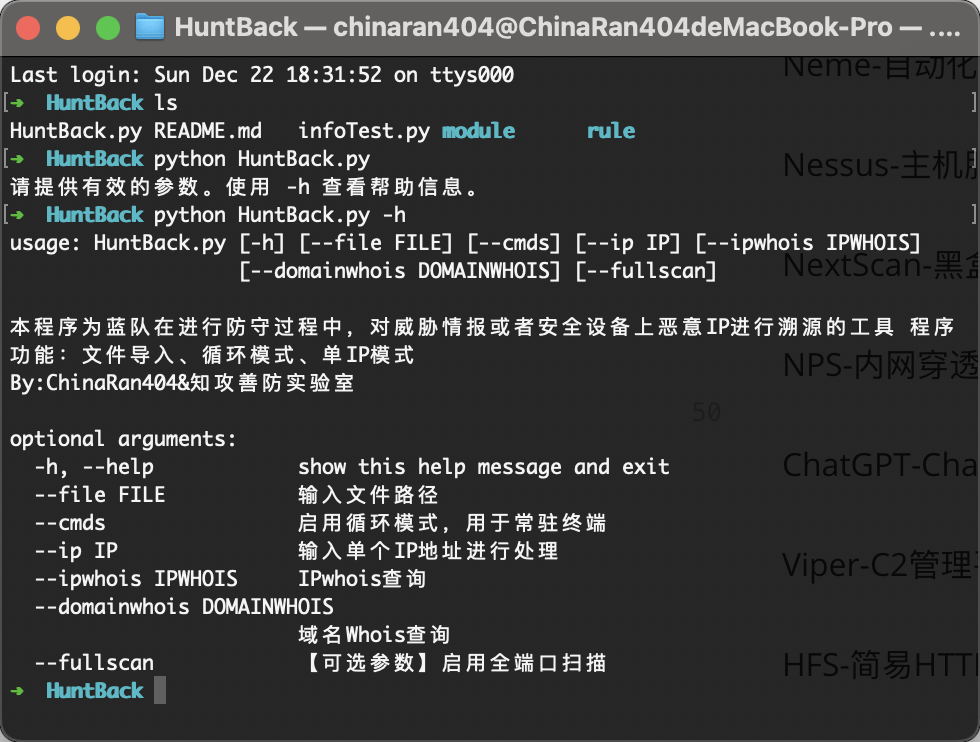
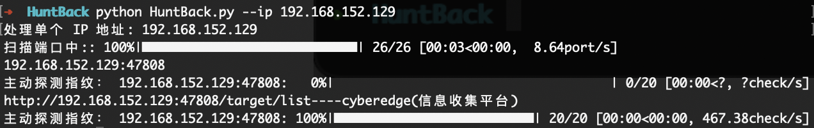
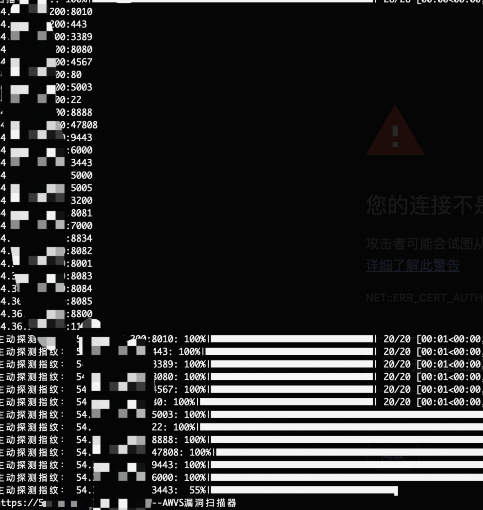
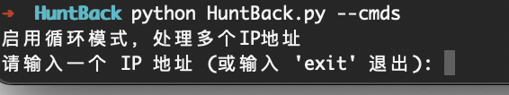
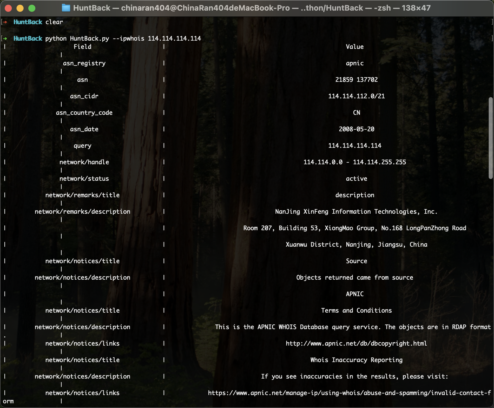
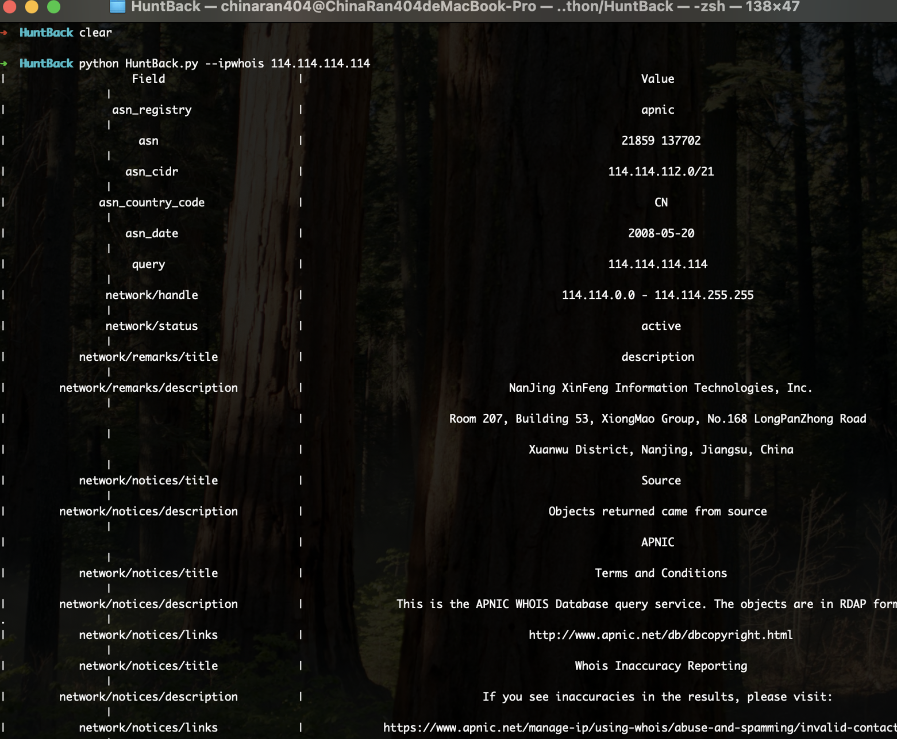
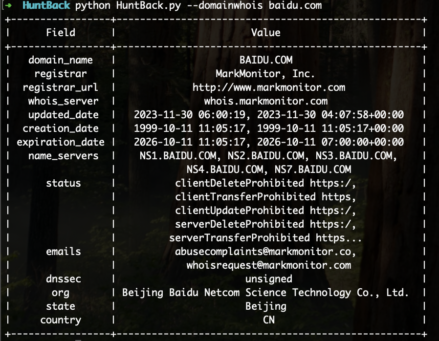

# HuntBack

HuntBack(反击狩猎)，用于攻防演练中，防守方对恶意ip进行web指纹扫描与识别

## 应用场景
在蓝队职守中，安全设备爆出恶意攻击ip地址，如果对方使用的是自己的服务器，并且搭建了一些安全业务，可使用本工具对目前已知工具进行探测

如果觉得有用，帮我们点一下右上角的star，😁


## 功能

1.红队指纹识别

2.ipwhois

3.域名whois

（后续开发）


## 指纹

### 指纹识别原理

通过发送HTTP数据包进行主动识别

### 目前已收集指纹

AWVS-Web漏洞扫描器

ARL-灯塔资产收集服务

大保健-边界资产梳理工具

H-资产收集工具

LangSrc-资产监控平台

Manjusaka-牛屎花C2管理平台

medusa-美杜莎红队武器库平台

Neme-自动化信息收集

Nessus-主机服务漏扫

NextScan-黑盒扫描

NPS-内网穿透工具

ChatGPT-ChatGPT（GPTweb）

Viper-C2管理平台

HFS-简易HTTP服务平台

Prism-X-棱镜红队作战平台

Everything-文件搜索服务

ScopeSentry-综合信息收集工具

CyberEdge-信息收集工具【老版本】

cyberedge-信息收集工具【GitHub开源】

SerializedPayloadGenerator-反序列化生成器

长亭洞鉴（X-Ray）安全评估系统

xray-scan-Xray扫描输出结果html

vulfocus-漏洞验证平台

Vulinbox-Agent(Yakit靶场)

Golin-基线核查工具

JavaChains-Java反序列化攻击工具

## 使用方法

开发版本：python3.8

在运行前，你需要安装相关依赖库

```pip
pip install whois
pip install ipwhois
pip install requests
```


然后运行python HuntBack.py即可


```shell
➜  HuntBack python HuntBack.py -h
usage: HuntBack.py [-h] [--file FILE] [--cmds] [--ip IP] [--ipwhois IPWHOIS]
                   [--domainwhois DOMAINWHOIS] [--fullscan]

本程序为蓝队在进行防守过程中，对威胁情报或者安全设备上恶意IP进行溯源的工具 程序功能：文件导入、循环模式、单IP模式
By:ChinaRan404&知攻善防实验室

optional arguments:
  -h, --help            show this help message and exit
  --file FILE           输入文件路径
  --cmds                启用循环模式，用于常驻终端
  --ip IP               输入单个IP地址进行处理
  --ipwhois IPWHOIS     IPwhois查询
  --domainwhois DOMAINWHOIS
                        域名Whois查询
  --fullscan            【可选参数】启用全端口扫描
```





单IP模式



文件批量模式




cmds职守模式



ipwhois




ipwhois




域名whois




## 联系我们&提交意见

联系我：公众号“知攻善防实验室”

